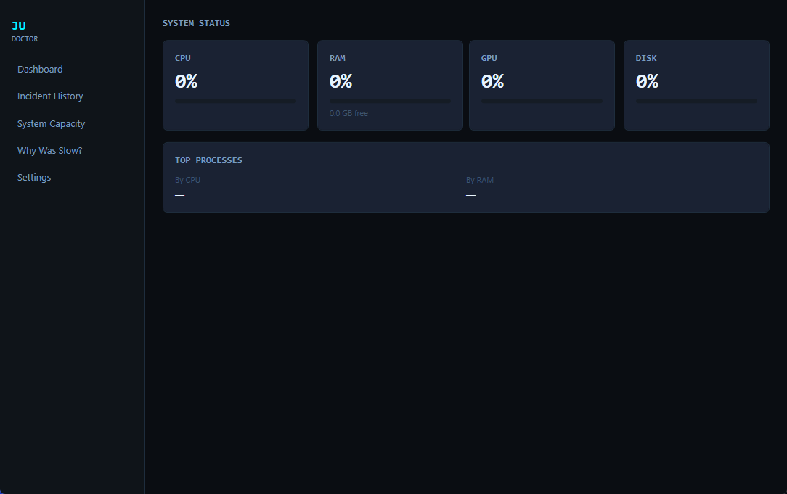
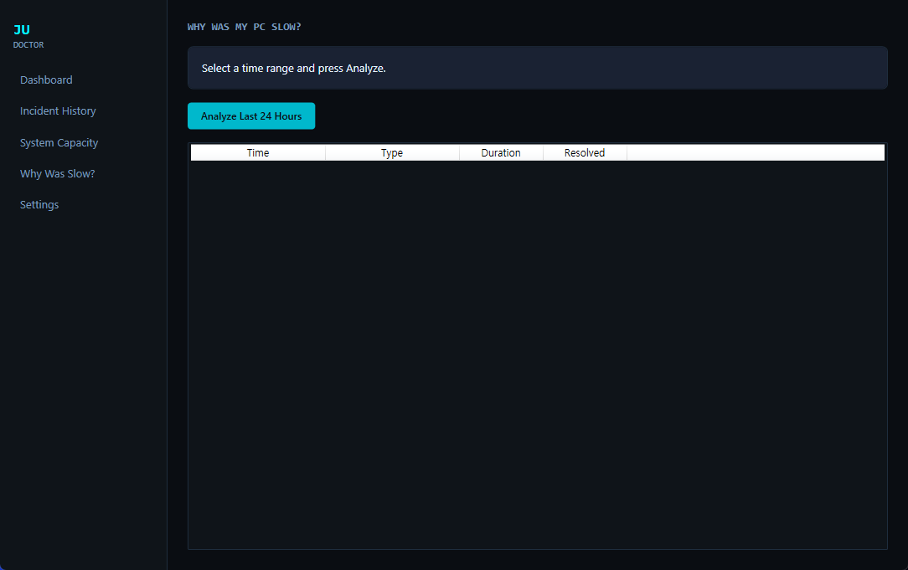
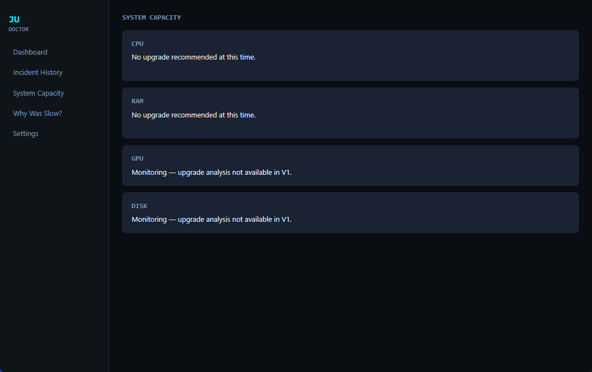

# JuDoctor

> **컴퓨터가 왜 느린지, 하드웨어를 바꾸기 전에 근거부터 확인합니다.**

[English](README.md) · [다운로드](https://github.com/ju0o/JuDoctor/releases/latest) · [전체 릴리즈](https://github.com/ju0o/JuDoctor/releases) · [개인정보](PRIVACY.md) · [알려진 문제](KNOWN_ISSUES.md)

JuDoctor는 Windows에서 조용히 백그라운드로 동작하면서 **CPU · RAM · GPU · VRAM · 디스크 상태를 기록하고, 반복되는 실제 병목을 찾아 설명하는 로컬 우선 PC 진단 프로그램**입니다.

작업 관리자가 숫자를 보여준다면, JuDoctor는 그 다음 질문에 답하려고 합니다.

> **“그래서 이게 진짜 문제인가? 지금 업그레이드할 때가 맞나?”**

---

## ⬇ JuDoctor 다운로드

### Windows 10 / 11 · x64

**[최신 Windows 설치본 다운로드 →](https://github.com/ju0o/JuDoctor/releases/latest)**

첫 안정 공개 버전에서는 아래 파일을 제공합니다.

- `JuDoctor-1.0.0-Setup.exe`
- `JuDoctor-1.0.0-Setup.exe.sha256`

`v1.0.0` 공개 후 직접 다운로드 링크:

- [JuDoctor-1.0.0-Setup.exe](https://github.com/ju0o/JuDoctor/releases/download/v1.0.0/JuDoctor-1.0.0-Setup.exe)
- [SHA256 체크섬](https://github.com/ju0o/JuDoctor/releases/download/v1.0.0/JuDoctor-1.0.0-Setup.exe.sha256)

JuDoctor는 **self-contained Windows 설치본**으로 배포되므로 별도 .NET Runtime 설치가 필요하지 않습니다.

### 설치 방법

1. GitHub Releases에서 `JuDoctor-1.0.0-Setup.exe`를 다운로드합니다.
2. 설치 파일을 실행합니다.
3. 장기 데이터를 자동으로 쌓고 싶다면 **Start with Windows**를 활성화합니다.
4. 이후에는 트레이에 그대로 두고, 확인이 필요할 때만 Dashboard를 열면 됩니다.

> 초기 unsigned 배포본은 Windows SmartScreen에서 알려지지 않은 게시자로 표시될 수 있습니다. 실행 전 같은 Release에 공개된 SHA256과 설치 파일의 해시를 비교할 수 있습니다.

PowerShell에서 확인:

```powershell
Get-FileHash .\JuDoctor-1.0.0-Setup.exe -Algorithm SHA256
```

자세한 내용은 [설치 문서](docs/INSTALLATION.md)를 참고하세요.

> **현재 배포 상태:** 소스는 이미 이 Public 저장소에 공개되어 있습니다. 설치본은 저장소의 Release workflow를 통해 GitHub Releases에 배포됩니다. 위 직접 링크가 아직 열리지 않는다면 [Releases 페이지](https://github.com/ju0o/JuDoctor/releases)에서 현재 바이너리 배포 상태를 확인해 주세요.

---

## 주요 기능

- Windows 트레이 백그라운드 상주
- CPU / RAM / GPU / VRAM / Disk 모니터링
- 짧은 순간값이 아닌 지속 시간과 복수 신호 기반 판단
- **Why Was My PC Slow?** 최근 느려진 원인 분석
- Incident History
- 로컬 SQLite 기록
- 최소 14일 관찰 후 CPU/RAM 업그레이드 권장 가능
- Windows 자동 시작
- 중복 프로세스 실행 방지
- 계정 불필요
- 클라우드 불필요
- V1 원격 텔레메트리 업로드 없음

### V1 업그레이드 권장 범위

V1은 장기 기록을 기반으로 **CPU / RAM 업그레이드 권장**을 할 수 있습니다. GPU · VRAM · Disk · Process · Temperature는 가능한 범위에서 진단 근거와 상태 확인에 사용하지만, V1에서는 GPU/디스크 교체 권장을 하지 않습니다.

JuDoctor는 CPU가 잠깐 100%가 됐다는 이유만으로 CPU 교체를 권하지 않습니다. GPU가 게임 중 99%라고 해서 경고를 남발하지도 않습니다.

---

## 왜 작업 관리자만으로는 부족한가?

| 상황 | 작업 관리자 | JuDoctor |
| --- | --- | --- |
| 빌드 중 CPU 100% | 숫자 표시 | 짧은 정상 부하는 대부분 무시 |
| RAM 부족 반복 | 현재 사용량만 확인 | 여러 작업 세션의 반복 압박 기록 |
| 15분 전에 PC가 느렸음 | 이미 지나간 상태 | 최근 기록을 기반으로 원인 확인 |
| RAM을 늘릴지 고민 | 직접 판단 | 충분한 장기 근거가 있을 때만 권장 |
| 게임 중 GPU 99% | 99% 표시 | 이것만으로 교체 권장하지 않음 |

JuDoctor는 **순간 사용률 하나가 아니라 지속 시간 + 반복성 + 함께 나타나는 신호**를 보도록 설계되었습니다.

---

## V1 진단 흐름

```text
백그라운드 관찰
      ↓
이상 징후 후보
      ↓
복수 신호 + 지속 시간 확인
      ↓
Incident
      ↓
진단 / 기록
      ↓
필요한 경우에만 알림
      ↓
장기 증거 축적
      ↓
CPU / RAM 업그레이드 판단
```

CPU/RAM 업그레이드 권장은 **최소 14일 관찰**이 선행되어야 합니다. 14일이 지났다고 자동으로 권장이 뜨는 것은 아닙니다.

---

## 개인정보

JuDoctor V1은 수집한 상태 기록을 사용자 PC에 보관합니다. JuDoctor 계정이 필요하지 않고, V1은 JuDoctor 클라우드로 원격 텔레메트리를 업로드하지 않습니다.

다음 내용 자체를 수집하도록 설계하지 않았습니다.

- 파일/문서 내용
- 브라우저 페이지 내용
- 터미널 명령어 텍스트
- 비밀번호
- 클립보드 내용

자세한 내용은 [PRIVACY.md](PRIVACY.md)를 참고하세요.

---

## V1 검증 기준

인증된 V1 기준선은 다음을 통과했습니다.

- 자동화 테스트 **93 / 93 PASS**
- Founder 수동 체크 **15 / 15 PASS**
- RTX 3050 계열에서 DXGI 전용 VRAM 약 5.9 GB 실측
- 재부팅 후 tray-only 자동 시작
- DB 지속 기록 및 재시작/재부팅 복구
- Resource Governor 비상/복귀 모드
- CPU/RAM Level 4 추천 알림 및 재시작 후 중복 방지 상태

최종 내부 인증 상태:

`USER_STABLE_PASS_WITH_KNOWN_ISSUES`

자세한 제한 사항은 [KNOWN_ISSUES.md](KNOWN_ISSUES.md)를 참고하세요.

---

## 화면

V1에는 다음 화면이 있습니다.

- **Dashboard** — 현재 PC 상태
- **Incident History** — 기록된 이상 구간
- **Why Was My PC Slow?** — 최근 느려진 원인 확인
- **System Capacity** — CPU/RAM 장기 용량 판단
- **Settings** — 자동 시작 및 설정

공개 V1 스크린샷:







---

## 소스에서 빌드하기

필요 환경:

- Windows 10/11
- .NET 9 SDK
- Installer까지 만들 경우 Inno Setup 6

```powershell
git clone https://github.com/ju0o/JuDoctor.git
cd JuDoctor
dotnet restore MainPCDoctor.sln
dotnet test MainPCDoctor.sln --configuration Release
.\installer\publish.ps1 -Installer
```

V1 정식 패키징은 self-contained **folder publish + installer** 방식입니다. 알려진 WPF pack-URI 제약 때문에 `PublishSingleFile=true`는 V1 정식 배포 경로가 아닙니다.

---

## Release 자동 배포

저장소의 `.github/workflows/release.yml`이 Windows Release 파이프라인을 담당합니다.

`v1.0.0` 같은 `v*` 태그가 올라가면:

```text
소스 checkout
   ↓
restore
   ↓
전체 test
   ↓
win-x64 self-contained publish
   ↓
Inno Setup
   ↓
SHA256 생성
   ↓
GitHub Release 공개
```

완성된 설치 파일은 일반 사용자가 [GitHub Releases](https://github.com/ju0o/JuDoctor/releases)에서 바로 다운로드할 수 있습니다.

---

## 문제 제보

하드웨어 호환성 제보가 특히 도움이 됩니다. Windows 버전, CPU/GPU, RAM 용량, JuDoctor 버전, 예상 결과와 실제 결과를 적어 주세요.

**로그나 DB를 Public Issue에 첨부하기 전에는 직접 내용을 확인하세요.**

- [버그 제보](https://github.com/ju0o/JuDoctor/issues/new?template=bug_report.yml)
- [기능 제안](https://github.com/ju0o/JuDoctor/issues/new?template=feature_request.yml)
- [지원 안내](SUPPORT.md)

---

## 오픈소스 / 라이선스

JuDoctor 소스는 **GNU GPL v3.0**으로 공개합니다. [LICENSE](LICENSE)

`JuDoctor`라는 공식 제품명과 브랜드를 제3자가 자신의 수정본에 공식 제품인 것처럼 사용하는 권리는 별도입니다. [TRADEMARKS.md](TRADEMARKS.md)

---

**JuDoctor V1 — Windows / Local-first / Open Source**

V1 라인은 안정성 · 하드웨어 호환성 · 개인정보 보호 · 신뢰할 수 있는 진단에 집중합니다.

> 작업 관리자는 숫자를 보여줍니다. **JuDoctor는 그 숫자가 진짜 문제인지 판단하려고 합니다.**
